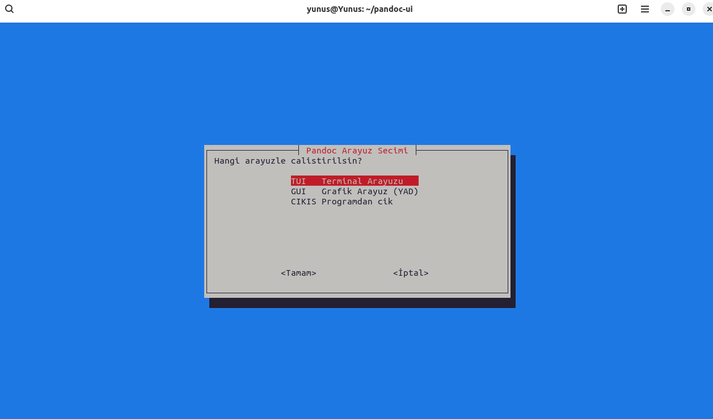
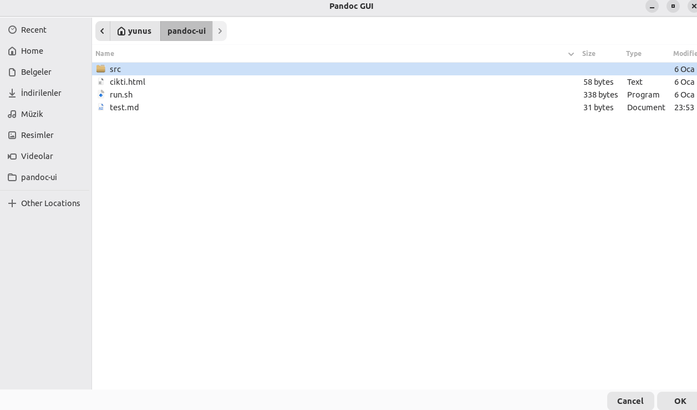
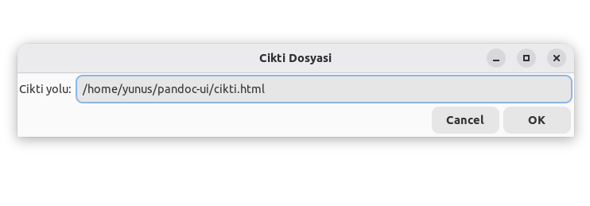
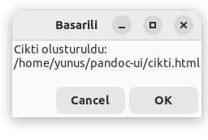
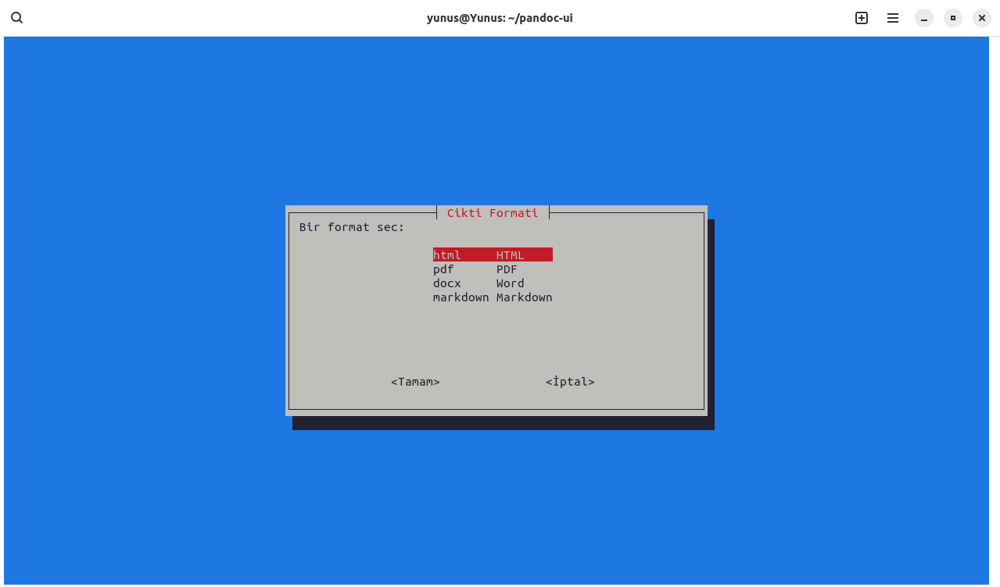
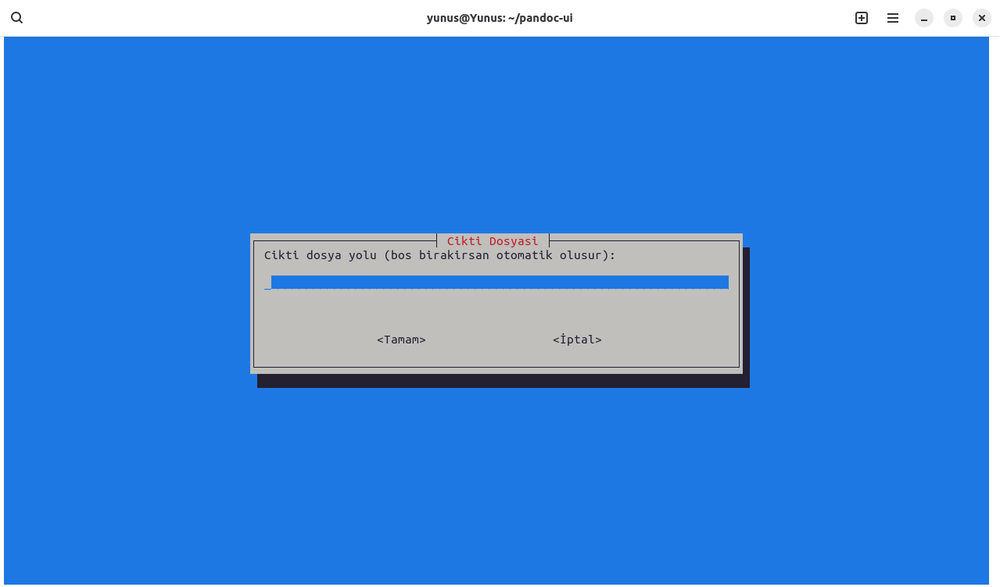
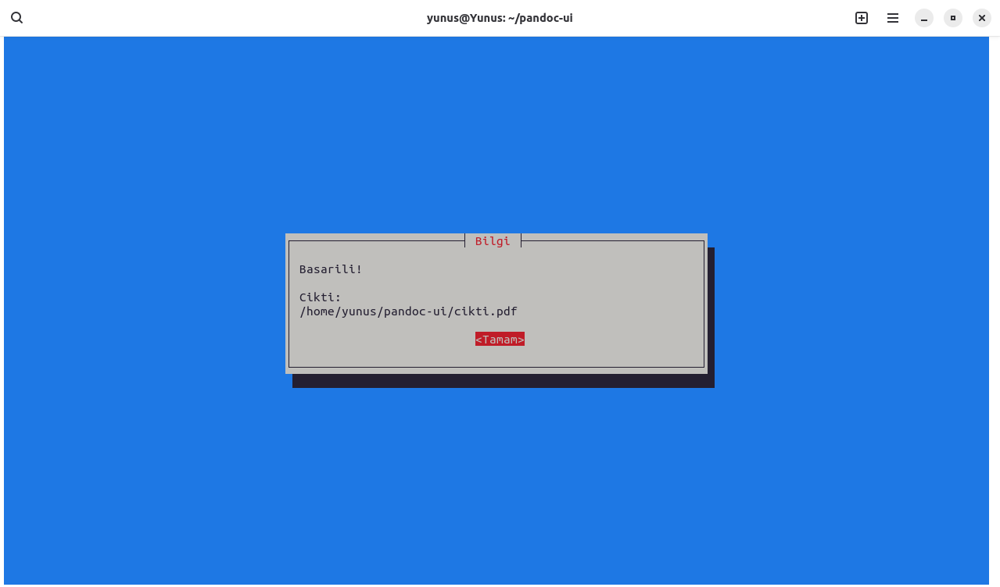

# Linux-Pandocui

<div align="center">

# 🐧 Linux Pandoc Dönüştürücü Projesi  
### GUI (YAD) & TUI (Whiptail) Tabanlı Belge Dönüştürme Aracı

Linux işletim sistemi üzerinde çalışan,  
**Pandoc** kullanarak belge formatlarını dönüştürmeyi amaçlayan  
**GUI (grafik arayüz)** ve **TUI (terminal arayüzü)** destekli Bash projesi.

Markdown • HTML • PDF • DOCX


<!-- GÖRSEL: proje kapak görseli -->

</div>

---

## 📌 Proje Tanımı

Bu proje, Pandoc’un sunduğu güçlü belge dönüştürme yeteneklerini  
Linux kullanıcıları için **daha erişilebilir ve kullanıcı dostu** hale getirmeyi amaçlamaktadır.

Komut satırı bilgisi sınırlı olan kullanıcılar için **GUI**,  
terminal ortamını tercih eden kullanıcılar için ise **TUI** arayüzü sunulmuştur.

Proje tamamen **Bash Script** ile geliştirilmiş olup  
harici bir programlama dili veya framework kullanılmamıştır.

---

## 🎯 Projenin Amacı

- Pandoc kullanımını kolaylaştırmak
- Komut yazma zorunluluğunu ortadan kaldırmak
- GUI ve TUI farkını uygulamalı olarak göstermek
- Linux ortamında script tabanlı arayüz geliştirmeyi öğrenmek
- Eğitim amaçlı, sade ve anlaşılır bir proje sunmak

---

## ✨ Temel Özellikler

- GUI (YAD) ile fare destekli kullanım
- TUI (Whiptail) ile terminal menüleri
- Girdi dosyası seçimi
- Çıktı formatı belirleme
- Çıktı dosya yolu seçimi
- Pandoc komut önizleme
- Hata kontrolü ve kullanıcı bilgilendirmesi

---

## 🛠️ Kullanılan Teknolojiler

- **Bash (Shell Script)**  
- **Pandoc**  
- **YAD** – Grafik kullanıcı arayüzü  
- **Whiptail** – Terminal tabanlı arayüz  

---

## 📁 Proje Dosya Yapısı

Projeyi Çalıştırma

```text
pandoc-ui
├── run.sh        # Ana çalıştırma dosyası
├── gui.sh        # YAD tabanlı grafik arayüz
├── tui.sh        # Whiptail tabanlı terminal arayüzü
├── test.md       # Örnek girdi dosyası
├── cikti.html    # Örnek çıktı dosyası
    README.md     # Proje dokümantasyonu
    img folder    #Projeden alınan ekran görüntüleri(resimler)
```

## Projeyi Çalıştırma

Öncelikle script dosyalarına çalıştırma izni verilir:
chmod +x run.sh gui.sh tui.sh
Ardından ana dosya çalıştırılır:
./run.sh

## Arayüz Seçim Mekanizması

Program çalıştığında kullanıcıdan arayüz seçmesi istenir:

- GUI (YAD)
- TUI (Whiptail)


## 🖥️ GUI (YAD) Arayüzü

### Girdi Dosyası Seçimi


### Çıktı Formatı Seçimi


### Çıktı Dosya Yolu



### Başarılı İşlem



## ⌨️ TUI (Whiptail) Arayüzü

### Dosya Yolu Girişi


### Format Seçim Menüsü


### Cikti Yolu 


### İşlem Tamamlandı



🎥 Tanıtım Videosu

YouTube Linki:

<!-- BURAYA VİDEO LİNKİ -->

## Geliştirici Bilgileri

İsim: Yunus Emre Nallı
Email: yunusemrenalli@hotmail.com


