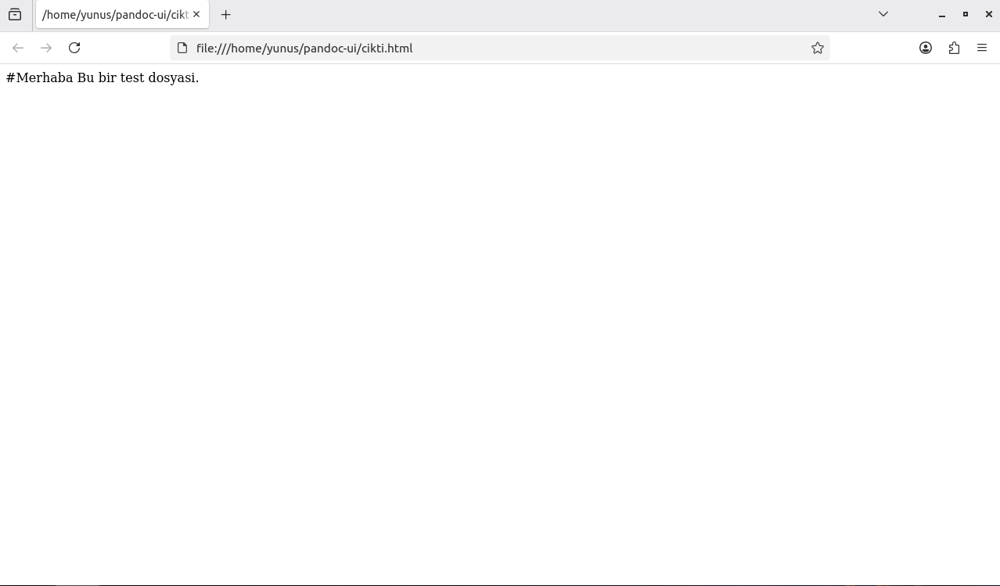
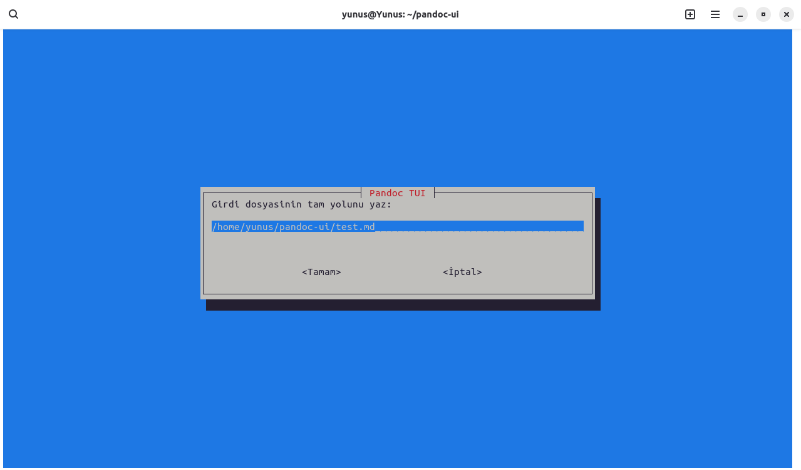
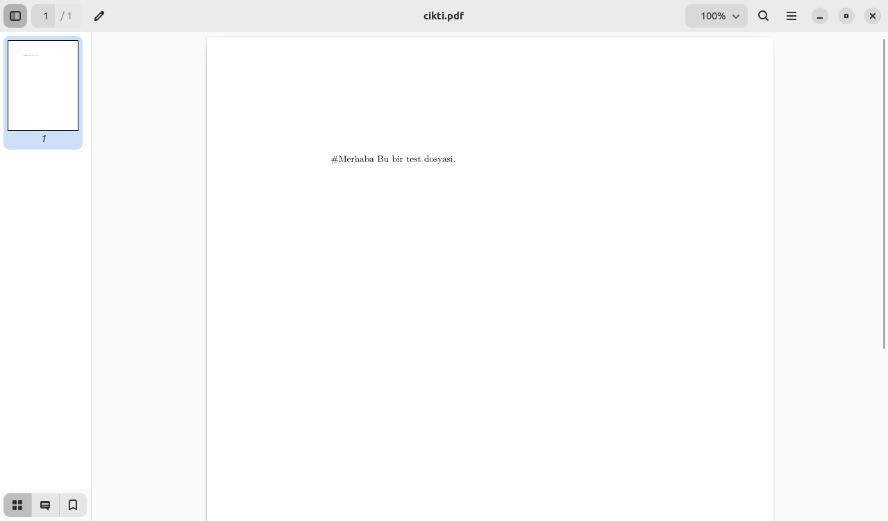

# Linux-Pandocui

<div align="center">

# 🐧 Linux Pandoc Dönüştürücü Projesi  
### GUI (YAD) & TUI (Whiptail) Tabanlı Belge Dönüştürme Aracı

Linux işletim sistemi üzerinde çalışan,  
**Pandoc** kullanarak belge formatlarını dönüştürmeyi amaçlayan  
**GUI (grafik arayüz)** ve **TUI (terminal arayüzü)** destekli Bash projesi.

Markdown • HTML • PDF • DOCX


<!-- GÖRSEL: proje kapak görseli -->

</div>

---

## 📌 Proje Tanımı

Bu proje, Pandoc’un sunduğu güçlü belge dönüştürme yeteneklerini  
Linux kullanıcıları için **daha erişilebilir ve kullanıcı dostu** hale getirmeyi amaçlamaktadır.

Komut satırı bilgisi sınırlı olan kullanıcılar için **GUI**,  
terminal ortamını tercih eden kullanıcılar için ise **TUI** arayüzü sunulmuştur.

Proje tamamen **Bash Script** ile geliştirilmiş olup  
harici bir programlama dili veya framework kullanılmamıştır.

---

## 🎯 Projenin Amacı

- Pandoc kullanımını kolaylaştırmak
- Komut yazma zorunluluğunu ortadan kaldırmak
- GUI ve TUI farkını uygulamalı olarak göstermek
- Linux ortamında script tabanlı arayüz geliştirmeyi öğrenmek
- Eğitim amaçlı, sade ve anlaşılır bir proje sunmak

---

## ✨ Temel Özellikler

- GUI (YAD) ile fare destekli kullanım
- TUI (Whiptail) ile terminal menüleri
- Girdi dosyası seçimi
- Çıktı formatı belirleme
- Çıktı dosya yolu seçimi
- Pandoc komut önizleme
- Hata kontrolü ve kullanıcı bilgilendirmesi

---

## 🛠️ Kullanılan Teknolojiler

- **Bash (Shell Script)**  
- **Pandoc**  
- **YAD** – Grafik kullanıcı arayüzü  
- **Whiptail** – Terminal tabanlı arayüz  

---

## 📁 Proje Dosya Yapısı

```text
pandoc-ui
├── run.sh        # Ana çalıştırma dosyası
├── gui.sh        # YAD tabanlı grafik arayüz
├── tui.sh        # Whiptail tabanlı terminal arayüzü
├── test.md       # Örnek girdi dosyası
├── cikti.html    # Örnek çıktı dosyası
    README.md     # Proje dokümantasyonu
    img folder    #Projeden alınan ekran görüntüleri(resimler)
```

## Pardus İşletim Sistemi Kurulumu

Bu proje Pardus işletim sistemi üzerinde geliştirilmiş ve test edilmiştir.
Pardus kullanmayan kullanıcılar, aşağıdaki bağlantılar aracılığıyla
VirtualBox üzerinde Pardus kurulumunu gerçekleştirebilir.

- [VirtualBox Kurulumu](https://www.virtualbox.org/wiki/Downloads)
- [Pardus ISO Dosyası](https://www.pardus.org.tr/indir/)

## 🧩 Proje Kurulumu ve Çalıştırma (Terminal Üzerinden)

Bu bölümde projeyi GitHub üzerinden indirip terminalden çalıştırma adımları gösterilmektedir.

### 1) Git ile projeyi klonla

```bash
git clone https://github.com/YunS16/Linux_Pandoc_ui.git
```
###2️⃣ Proje dizinine girin
```
cd Linux_Pandoc_ui
```
### 3️⃣ Gerekli paketleri kurun (Debian / Pardus / Ubuntu)

Bu adımda projenin çalışabilmesi için gerekli olan tüm paketler sisteme kurulmaktadır.
Pandoc belge dönüştürme işlemleri için, YAD ve Whiptail arayüzler için,
LaTeX ise PDF çıktısı oluşturabilmek için kullanılmaktadır.

```bash
sudo apt update
sudo apt install -y pandoc yad whiptail texlive
```
###4️⃣Script dosyalarına çalıştırma izni verin
```
chmod +x run.sh gui.sh tui.sh
```
###5️⃣ Programı çalıştırın
```
./run.sh
```
## Arayüz Seçim Mekanizması

Program çalıştığında kullanıcıdan arayüz seçmesi istenir:

- GUI (YAD)
- TUI (Whiptail)
- 


## 🖥️ GUI (YAD) Arayüzü

### Girdi Dosyası Seçimi


Bu adımda kullanıcı dönüştürülmek istenen belgeyi grafik arayüz üzerinden seçer.
Dosya seçimi tamamlandıktan sonra bir sonraki aşamaya geçilir.


### Çıktı Formatı Seçimi


Kullanıcı burada belgenin hangi formata dönüştürüleceğini belirler.
HTML, PDF ve DOCX gibi farklı formatlar desteklenmektedir.


### Çıktı Dosya Yolu


Dönüştürülen dosyanın hangi dizine kaydedileceği bu adımda seçilir.
Böylece çıktı dosyası kullanıcı tarafından kolayca bulunabilir.


### İşlem sonucu 


Dönüştürme işlemi başarıyla tamamlandığında kullanıcı bilgilendirilir.
Oluşturulan çıktı dosyası seçilen dizine kaydedilir.



## ⌨️ TUI (Whiptail) Arayüzü

### Dosya Yolu Girişi


Kullanıcı dönüştürülecek dosyanın tam yolunu terminal üzerinden girer.
Bu yöntem grafik arayüz bulunmayan sistemlerde kullanım sağlar.

### Format Seçim Menüsü


Terminal tabanlı menü aracılığıyla çıktı formatı seçilir.
Kullanıcı yön tuşlarıyla menüde rahatça gezinebilir.

### Cikti Yolu 


### İşlem Tamamlandı


İşlem başarıyla tamamlandığında terminal üzerinden bilgilendirme yapılır.
Çıktı dosyası belirtilen dizinde oluşturulur.




🎥 Tanıtım Videosu

YouTube Linki:

<!-- BURAYA VİDEO LİNKİ -->

## Geliştirici Bilgileri

İsim: Yunus Emre Nallı
Email: yunusemrenalli@hotmail.com


